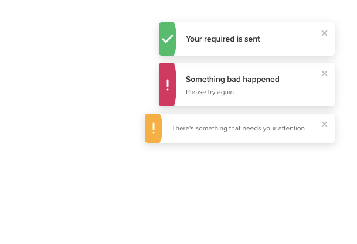

# eve toast
eve's toast service for pop-up notifications, built on Vue. 
We support:
- [x] custom title / description of the toasts (of course 😆)
- [x] three different styles of toasts  ✅ ⚠️ ⭕
- [x] displaying the queue of toasts on the top-right / top-center of the interface
- [x] toasts that can be both manually closed, and self-closed after some duration
- [x] callback when a toast opens / closes



### Install
```
yarn add eve-toast
```

### Usage
The package comes with 3 exports that can be accessed with
    ```
    import { EveToastQueue, queueToast, EveToast } from 'eve-toast'
    ```
* `EveToastQueue`: the Vue component that renders a queue of toasts, can be registered and used like other custom components.
* `queueToast (toastOptions: EveToast): void`: the util to queue a toast.
* `EveToast`: as this project is built on TypeScript, we ship with an interface that makes type easier:
    ```
    interface EveToast {
      id?: string
      title?: string
      description?: string
      type: 'error' | 'warning' | 'success' // different styles of the toast
      position?: 'right' | 'center' // position of the toast relative to the parent of `EveToastQueue`
      duration?: number // life of a self-closing toast, in ms 
      onClose?: () => void // callback when the toast closes (manually or self-closed)
      onOpen?: () => void // callback when the toast opens
    }
    ```

### Future support candidates:
- [ ] configurable styles / types of the toasts
- [ ] more positions of the queue (top-left, bottom-right, etc.)
- [x] callbacks when a toast opens
- [ ] dark mode
- [ ] ...and more! Suggestion welcomed 😃

#### todos
- [ ] setup demo page